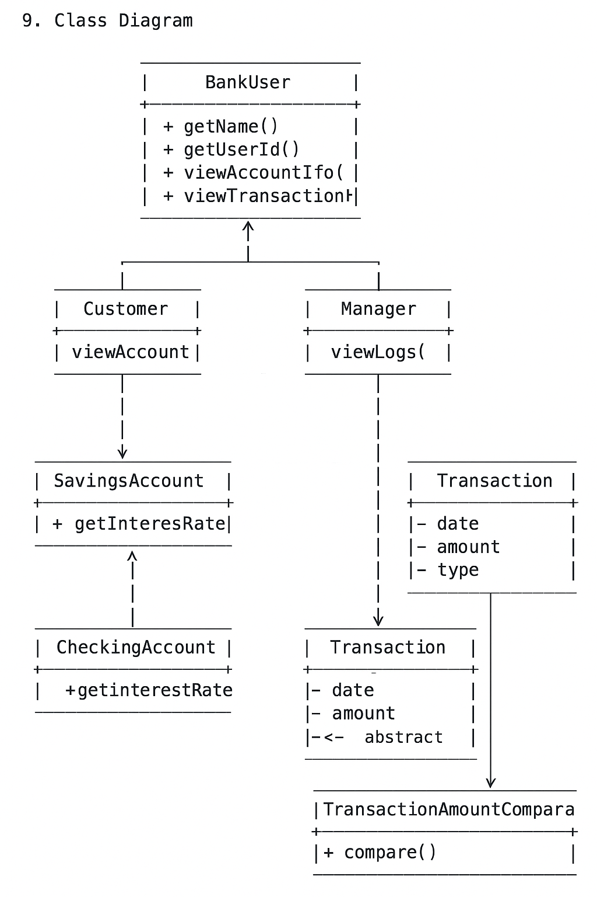

# 1 Introduction:
The Online Banking System (OBS) is a application that simulates basic online banking functionality for both customers and bank managers. Customers can access their account details, view transactions (credit/debit) including deposit and withdraw with the day, month and year it was made, and check interest rates, while managers can keep a record of what their customers do.

# 2 Functional Requirements  

# 2.1 Customer Functionalities:
- View account details (type, balance, interest rate)
- View full transaction history
- Filter transactions by debit/credit card
- View dates of deposit/withdrawals (day/month/year)

# 2.2 Manager Functionalities:
- Monitor all customer activities
- View customer transaction histories and balances

# 3. Expected Output:
the customer should expect to be able to do:
- Displaying structured account information including type, balance, and interest rates
- Printing complete transaction histories in an organized format
- Showing dates associated with deposits and withdrawals
- Allowing bank managers to view logs of customer usage and actions within the system   

# 4 project heirarchy

- **BankUser** (interface)  
  ↳ Common contract for all system users (e.g., Customer, Manager)  
  ↳ Methods: `viewDetails()`, `viewTransactions()`, etc.

    - **Customer** (implements BankUser)  
      ↳ Represents a banking customer  
      ↳ Uses an associated `Account` and a list of `Transaction` objects

        - **SavingsAccount** (extends Account)  
          ↳ Has savings-specific interest rate calculations

        - **CheckingAccount** (extends Account)  
          ↳ Basic account without interest, or with flat fee logic

    - **Manager** (implements BankUser)  
      ↳ Oversees customer activities and logs  
      ↳ Does not directly own an `Account`, but accesses `TransactionHistory`

- **Account** (abstract class)  
  ↳ Common structure for all account types  
  ↳ Abstract Method: `getInterestRate()`

- **Transaction** (implements Comparable)  
  ↳ Represents individual credit/debit card transactions  
  ↳ Includes date, type, and amount  
  ↳ Sorted chronologically via `compareTo()` on `date`

- **TransactionAmountComparator** (implements Comparator<Transaction>)  
  ↳ Allows sorting transactions by amount

- **TransactionHistory**  
  ↳ Holds a list of all `Transaction` objects for an account  
  ↳ Provides filtering and grouping utilities

- **BankSystemMain**  
  ↳ The main application class  
  ↳ Handles TextIO-based CLI interaction  
  ↳ Instantiates `Customer` and `Manager` objects and routes control

  #5 interfaces and their purpose

  BankUser: is the interface that insures that all user-related classes (Custumer, Manager) implements a commone set of methods that define how users interact with the system - without forcing them to make these interactions.

  # 6  Runtime Polymorphism  

- The Account class has an abstract method getInterestRate() which is overridden by SavingsAccount and CheckingAccount
- The BankUser interface is implemented by Customer and Manager to allow more freedom in it's behavoir based on user roles

# 7 TextIO Usage  

**Class:** BankSystemMain  
**Purpose:** Used for all terminal-based input/output operations to allow users (both customers and managers) to interact with the system through menu selections and structured feedback

# 8  Comparable and Comparator Usage  

- Transaction class implements Comparable<Transaction>` to sort transactions by date
- A separate class TransactionAmountComparator implements Comparator<Transaction> to support sorting by transaction amount

# 9 Class Diagram

# 10 What will be implemented for Deliverable 2

- my Customer class will be implemented for deliverable 2

